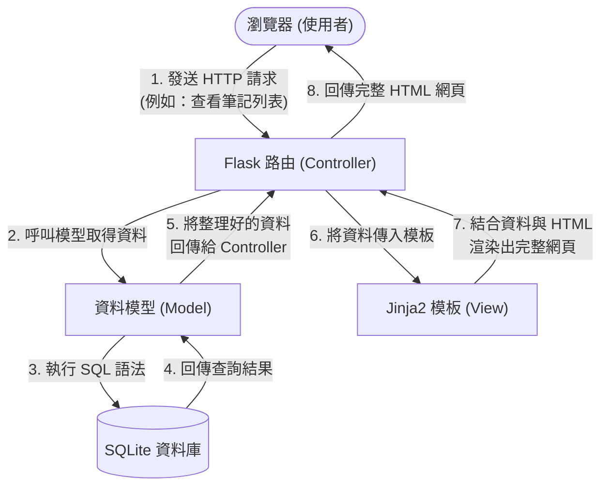

# 讀書筆記本系統 - 系統架構文件 (Architecture)

這份文件根據產品需求文件 (PRD) 規劃了「讀書筆記本系統」的技術架構與資料夾結構，並說明各元件的運作方式。

## 1. 技術架構說明

本系統為輕量級的網頁應用程式，採用傳統的伺服器端渲染 (Server-Side Rendering) 方式開發，並不需要將前後端分離。

### 選用技術與原因

* **後端框架：Python + Flask**
  * **原因**：Flask 是一個輕量且靈活的 Python 網頁框架，非常適合用來快速開發中小型專案。學習曲線平緩，能讓開發者專注於核心功能的實作。
* **模板引擎：Jinja2**
  * **原因**：Jinja2 是 Flask 內建支援的模板引擎，能將後端處理好的資料動態塞入 HTML 檔案中渲染成完整的網頁，直接回傳給瀏覽器。
* **資料庫：SQLite**
  * **原因**：輕量、無伺服器 (Serverless) 且內建於 Python 之中。只需要一個檔案就能儲存所有資料，非常適合單機版應用、開發測試以及簡單的筆記本系統。
* **前端樣式：純 HTML / CSS**
  * **原因**：保持專案的單純與輕量化，不依賴複雜的前端框架，符合 MVP 快速驗證與開發的理念。

### Flask MVC 模式說明

本系統遵循 MVC (Model-View-Controller) 的設計模式，將系統拆分為三個主要部分，各司其職：

* **Model (資料模型)**：負責與 SQLite 資料庫溝通。定義書籍的資料結構（書名、日期、心得、評分、分類），並處理所有資料的 CRUD（新增、讀取、更新、刪除）操作。
* **View (視圖)**：負責呈現使用者介面。也就是 `templates/` 資料夾下的 Jinja2 HTML 檔案。它不會處理複雜邏輯，只負責把 Controller 傳遞過來的資料漂亮地顯示出來。
* **Controller (控制器)**：系統的核心樞紐（在 Flask 中主要實作為 Routes）。負責接收使用者的 HTTP 請求（例如點擊連結或送出表單），呼叫 Model 去拿資料或存資料，接著挑選適合的 View 模板，並把資料傳遞給模板進行渲染。

---

## 2. 專案資料夾結構

為了讓程式碼井然有序，我們會依照功能將程式碼拆分到不同的資料夾中。

```text
web_app_development/
├── app/                      ← 應用程式的核心程式碼目錄
│   ├── __init__.py           ← 初始化 Flask 應用程式與載入設定
│   ├── models/               ← Model 層：負責資料庫操作
│   │   └── book.py           ← 定義書籍資料的結構與讀寫邏輯
│   ├── routes/               ← Controller 層：負責路由與商業邏輯
│   │   └── book_routes.py    ← 處理首頁、新增筆記、查看詳情等請求
│   ├── templates/            ← View 層：存放 Jinja2 HTML 模板
│   │   ├── base.html         ← 共用模板 (包含 Navbar, Header 等)
│   │   ├── index.html        ← 首頁 (筆記列表總覽)
│   │   ├── add.html          ← 新增 / 編輯筆記的表單頁面
│   │   └── detail.html       ← 單筆書籍筆記的詳細資訊頁面
│   └── static/               ← 存放靜態檔案
│       ├── css/
│       │   └── style.css     ← 網站共用的 CSS 樣式
│       └── js/               ← (如有需要) 網站用到的 JavaScript
├── instance/                 ← 存放與執行環境相關且不應進版控的檔案
│   └── database.db           ← SQLite 資料庫檔案
├── docs/                     ← 存放專案文件 (如 PRD.md, ARCHITECTURE.md)
├── requirements.txt          ← 紀錄專案依賴的 Python 套件與版本
└── app.py                    ← 程式的進入點，負責啟動整個 Flask 伺服器
```

---

## 3. 元件關係圖

以下流程圖說明當使用者在瀏覽器進行操作時，系統內部的元件是如何互動的：



---

## 4. 關鍵設計決策

1. **採用 MVC 架構分離關注點**
   * **原因**：將負責資料存取的 Model、負責呈現畫面的 View 與負責流程控制的 Controller 分開，可以讓程式碼結構更清晰。未來若要修改介面外觀，就不會不小心弄壞資料庫操作的程式碼，大幅提升可維護性。

2. **使用伺服器端渲染 (Server-Side Rendering)**
   * **原因**：對於這個輕量級的讀書筆記系統，直接使用 Flask + Jinja2 在伺服器端產生 HTML 是開發速度最快、架構最單純的選擇。這能省去架設與維護複雜前端框架 (如 React) 及實作前後端 API 的額外成本。

3. **選擇 SQLite 作為資料庫**
   * **原因**：系統的目標是提供一個個人用的「純粹筆記空間」。SQLite 不需要架設獨立的資料庫伺服器，資料都存在單一檔案中，非常適合個人使用、本機開發與測試，完美契合「輕量、聚焦」的核心價值。

4. **集中管理路由 (Routes) 邏輯**
   * **原因**：避免將所有的程式碼都塞進 `app.py` 中。透過將路由邏輯拆分到 `app/routes/` 目錄下，可以讓主程式碼更乾淨，未來若有新的功能模組（例如：使用者管理）也更容易擴充。
