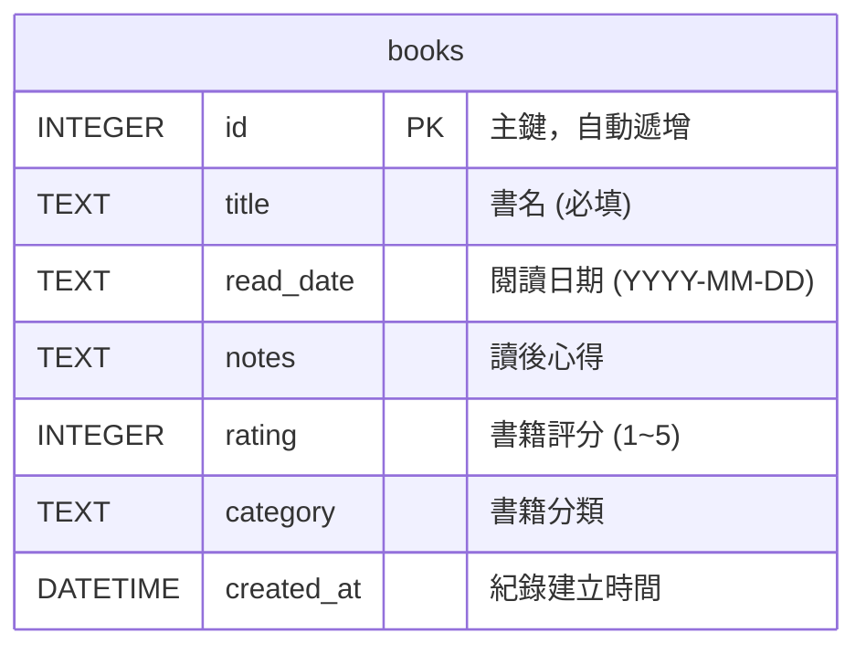

# 讀書筆記本系統 - 資料庫設計 (DB Design)

這份文件根據功能需求與流程圖，定義了「讀書筆記本系統」的 SQLite 資料庫結構。

## 1. ER 圖 (實體關係圖)

本系統目前為單一實體的輕量級應用，主要資料表為 `books`。

## 2. 資料表詳細說明

### `books` 資料表

儲存所有使用者記錄的讀書筆記資訊。

| 欄位名稱 | 型別 | 必填 | 預設值 | 說明 |
| :--- | :--- | :--- | :--- | :--- |
| `id` | INTEGER | 是 | (AUTOINCREMENT) | Primary Key，每筆紀錄的唯一識別碼。 |
| `title` | TEXT | 是 | - | 書籍的名稱。 |
| `read_date` | TEXT | 否 | - | 閱讀完畢或記錄的日期，建議格式為 ISO 8601 (`YYYY-MM-DD`)。 |
| `notes` | TEXT | 否 | - | 使用者撰寫的讀後心得。 |
| `rating` | INTEGER | 否 | - | 1 到 5 的整數，代表星等評分。 |
| `category` | TEXT | 否 | - | 書籍分類標籤（例如：文學小說、商業理財等）。 |
| `created_at` | DATETIME | 是 | CURRENT_TIMESTAMP | 此筆資料被寫入資料庫的當下時間。 |

## 3. SQL 建表語法

完整的建表語法已儲存於 `database/schema.sql` 檔案中。

## 4. Python Model 程式碼

系統採用 Python 內建的 `sqlite3` 模組進行資料庫操作。Model 類別實作已儲存於 `app/models/book.py` 檔案中，包含了對 `books` 資料表的標準 CRUD 方法：
- `create`: 新增一筆書籍紀錄
- `get_all`: 取得所有書籍紀錄（預設按建立時間排序）
- `get_by_id`: 根據 ID 取得單筆詳細資料
- `update`: 更新特定書籍紀錄的內容
- `delete`: 根據 ID 刪除特定書籍紀錄
