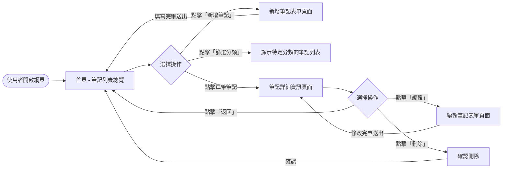
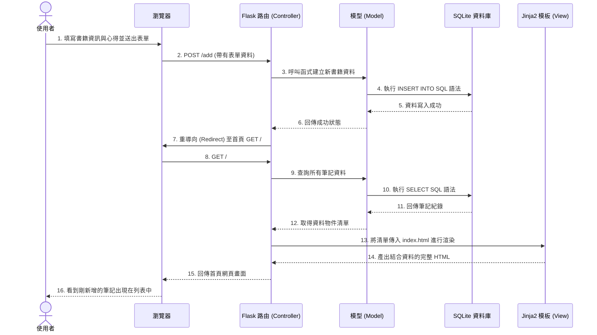

# 讀書筆記本系統 - 流程圖文件 (Flowchart)

這份文件根據產品需求文件 (PRD) 與系統架構 (ARCHITECTURE) 繪製了讀書筆記本系統的流程圖，幫助我們更直觀地了解使用者的操作路徑與系統資料的流動方式。

## 1. 使用者流程圖 (User Flow)

此圖描述使用者進入網站後，可以進行的各種操作路徑。

## 2. 系統序列圖 (Sequence Diagram)

此圖以「新增筆記」為例，描述使用者從前端填寫表單到後端存入資料庫的完整技術流程。

## 3. 功能清單與路由對照表

以下表格對應了使用者的操作與後端 Flask 的路由設計：

| 功能描述 | URL 路徑 | HTTP 方法 | 說明 |
| :--- | :--- | :--- | :--- |
| **首頁 / 筆記列表** | `/` | GET | 從資料庫讀取所有書籍筆記並顯示列表，可帶參數作分類篩選。 |
| **顯示新增表單** | `/add` | GET | 顯示一個空白表單供使用者填寫新筆記。 |
| **送出新增資料** | `/add` | POST | 接收前端表單的資料，寫入資料庫後重導向回首頁。 |
| **查看筆記詳情** | `/book/<id>` | GET | 根據書籍 ID，顯示該本書的完整心得與評分等詳細資訊。 |
| **顯示編輯表單** | `/edit/<id>` | GET | 根據書籍 ID，載入舊資料並顯示於表單上供修改。 |
| **送出修改資料** | `/edit/<id>` | POST | 接收前端表單修改後的資料，更新資料庫後重導向回詳情頁或首頁。 |
| **刪除筆記** | `/delete/<id>`| POST | 根據書籍 ID 刪除資料庫中的該筆紀錄，刪除後重導向回首頁。（傳統表單使用 POST，不使用 DELETE） |
